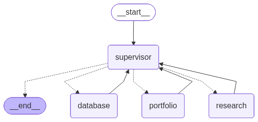
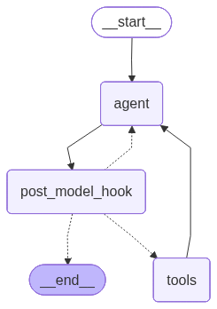

# NexTrade: Multi-Agent Trading System for Intelligent Stock Market Operations

A sophisticated multi-agent system that automates and optimizes stock market trading operations through intelligent agent coordination, built with LangGraph and featuring human-in-the-loop safety mechanisms.

[](https://opensource.org/licenses/MIT)
[](https://www.python.org/downloads/)
[](https://github.com/langchain-ai/langgraph)
[](Documentation/PRODUCTION_READY.md)

> **⚖️ License:** MIT License | **👤 Author:** Veeresh Gowda  
> **📄 Full License Details:** See [LICENSE](LICENSE) and [LICENSING_AND_DEPLOYMENT.md](Documentation/LICENSING_AND_DEPLOYMENT.md)

## Overview

NexTrade is a production-ready multi-agent trading system that demonstrates how intelligent agent coordination can enhance financial decision-making while maintaining essential human oversight. The system orchestrates three specialized agents—Research, Portfolio, and Database—under a central supervisor to deliver comprehensive trading workflows from market research to trade execution and portfolio tracking.



*Figure 1: NexTrade Multi-Agent System Architecture showing the custom supervisor coordinating specialized agents*

### Key Features

- 🤖 **Multi-Agent Architecture**: Specialized agents for research, trading, and data management
- 🛡️ **Human-in-the-Loop Safety**: Mandatory human approval for all trading operations
- 📊 **Real-time Market Data**: Live stock prices and comprehensive market analysis
- 💾 **Persistent Portfolio Tracking**: SQLite database with complete audit trails
- 🔄 **Intelligent Workflow Orchestration**: Automated task delegation and coordination
- 🌐 **Multiple Interfaces**: Command-line tools and Streamlit web application
- 🔧 **Production Ready**: Comprehensive testing suite and error handling

## Target Audience

- **Individual Traders**: Enhanced decision-making tools with automated research
- **Financial Advisors**: Professional portfolio management capabilities
- **AI/ML Engineers**: Reference implementation for multi-agent financial systems
- **Students & Researchers**: Educational platform for learning agentic AI concepts

## Prerequisites

- **Python**: 3.11 or higher
- **uv**: Modern Python package manager ([Install uv](https://docs.astral.sh/uv/getting-started/installation/))
- **Operating System**: Windows, macOS, or Linux
- **Memory**: Minimum 4GB RAM recommended
- **Internet Connection**: Required for market data and AI model access
- **API Keys**: Azure OpenAI or Groq account for LLM access

## Installation

### Repository Structure

```
AAIDC-Module2-MultiAgent/
├── README.md                    # Project documentation
├── LICENSE                     # MIT license
├── pyproject.toml              # Python project configuration
├── uv.lock                     # Dependency lock file
├── langgraph.json              # LangGraph configuration
├── .env.example                # Environment variables template
├── .gitignore                  # Git ignore patterns
├── streamlit_app.py            # Web interface application
├── check_setup.py              # Environment verification
├── Makefile                    # Build automation
├── Documentation/              # Supplementary documentation
│   ├── README.md               # Documentation overview
│   ├── QUICK_START.md          # 3-minute setup guide
│   ├── SETUP.md                # Production setup & deployment guide
│   └── PRODUCTION_READY_SUMMARY.md # Implementation status
├── demos/                      # Interactive demo scripts
│   ├── README.md               # Demo documentation
│   ├── demo_agents.py          # Complete system demo
│   ├── demo_database_agent.py  # Database operations demo
│   ├── demo_hitl_complete.py   # HITL mechanism demo
│   └── demo_place_order_hitl.py # Order placement demo
├── src/                        # Main source code
│   └── agent/                  # Agent implementation
│       ├── __init__.py         # Package initialization
│       ├── graph.py            # Multi-agent system core
│       ├── prompts.py          # Agent system prompts
│       ├── tools.py            # Trading and research tools
│       ├── database_tools.py   # Data persistence tools
│       ├── state.py            # System state management
│       ├── context.py          # Configuration management
│       └── utils.py            # Utility functions
├── data/                       # Database storage
│   └── trading_orders.db       # SQLite database
├── images/                     # Agent visualizations
│   ├── database_agent.png      # Database agent graph
│   ├── portfolio_agent.png     # Portfolio agent graph
│   ├── research_agent.png      # Research agent graph
│   ├── supervisor_custom.png   # Custom supervisor graph
│   └── supervisor_highlevel.png # High-level supervisor graph
├── publication/                # Academic publication materials
│   ├── NexTrade_Publication.md # Complete publication document
│   ├── Publication_Summary.md  # Executive summary
│   ├── Architecture_Diagrams.md # Technical diagrams
│   ├── Test_Results_September_2025.md # Test validation results
│   └── README.md               # Publication overview
└── tests/                      # Test suite
    ├── conftest.py             # Test configuration
    ├── integration_tests/      # End-to-end tests
    │   ├── __init__.py
    │   ├── test_graph.py       # Agent workflow tests
    │   ├── test_api.py         # FastAPI endpoint tests
    │   └── test_multi_agent_system.py
    └── unit_tests/             # Component tests
        ├── __init__.py
        ├── test_tools.py       # Agent tools tests
        ├── test_database_tools_comprehensive.py
        ├── test_guardrails.py  # Safety tests
        └── ... (10+ test files)
```

**Key Directories:**
- **`src/agent/`** - Core multi-agent system implementation
- **`tests/`** - Automated pytest test suite (80+ tests)
- **`demos/`** - Interactive demo scripts for manual testing
- **`data/`** - SQLite database for order and portfolio storage
- **`images/`** - System architecture visualizations

**Quick Start Files:**
- **`streamlit_app.py`** - Launch web UI: `streamlit run streamlit_app.py`
- **`demos/demo_agents.py`** - Interactive demo: `python demos/demo_agents.py`
- **`src/api.py`** - FastAPI backend: `uvicorn src.api:app --reload`
- **`check_setup.py`** - Verify installation: `python check_setup.py`

**Documentation Files:**
- **`README.md`** - This file (comprehensive guide)
- **`Documentation/`** - All supplementary documentation
  - **`QUICK_START.md`** - 3-minute setup guide
  - **`SETUP.md`** - Production setup and deployment guide
  - **`PRODUCTION_READY_SUMMARY.md`** - Implementation status
- **`demos/README.md`** - Demo scripts documentation

### 1. Clone the Repository

```bash
git clone <repository-url>
cd AAIDC-Module2-MultiAgent
```

### 2. Create Virtual Environment

```bash
# Using uv (recommended - fast and modern)
uv venv .venv

# Activate the virtual environment
source .venv/bin/activate  # Linux/Mac
# or
.venv\Scripts\activate     # Windows
```

### 3. Install Dependencies

```bash
# Install project dependencies using uv
uv sync

# Install LangGraph CLI for advanced features
uv add "langgraph-cli[inmem]"
```

### 4. Environment Setup

Create a `.env` file in the project root:

```bash
cp .env.example .env
```

Configure your API keys in the `.env` file:

```env
# Azure OpenAI Configuration (Primary)
AZURE_OPENAI_API_KEY=your_azure_openai_key
AZURE_OPENAI_ENDPOINT=your_azure_endpoint
OPENAI_API_VERSION=2024-12-01-preview
AZURE_OPENAI_DEPLOYMENT_NAME=gpt-4o

# Groq Configuration (Fallback)
GROQ_API_KEY=your_groq_api_key

# Optional: LangSmith Tracing
LANGSMITH_API_KEY=your_langsmith_key
```

### 5. Verify Installation

```bash
# Run the interactive demo
python demos/demo_agents.py

# OR run automated pytest tests
pytest -v
```

The demo provides an interactive testing suite to verify system configuration.

## Usage

### Command Line Interface

#### Run Interactive Demos
```bash
# Complete system demo (recommended)
python demos/demo_agents.py

# Database operations demo
python demos/demo_database_agent.py

# Human-in-the-loop mechanism demo
python demos/demo_hitl_complete.py

# Order placement with HITL demo
python demos/demo_place_order_hitl.py
```

**Demo Features:**
- Interactive testing with menu options
- Automated test scenarios
- Manual query testing
- HITL approval workflows

See `demos/README.md` for detailed documentation.

### Web Interface

Launch the Streamlit application for a user-friendly interface:

```bash
streamlit run streamlit_app.py
```

The web interface provides:
- Interactive chat with the multi-agent system
- Agent visualization capabilities
- Configuration options for different AI models
- Sample trading scenarios
- **Two deployment modes:**
  - **Direct Mode**: Directly uses the multi-agent supervisor (default)
  - **API Mode**: Consumes FastAPI backend endpoints (requires API server running)

### REST API Backend

For production deployments, use the FastAPI backend:

```bash
# Start the API server
cd src
uvicorn api:app --reload --host 0.0.0.0 --port 8000

# Access API documentation
# Open browser to: http://localhost:8000/docs
```

The REST API provides:
- Professional endpoints for chat interactions
- Health check and monitoring capabilities
- Portfolio and order management endpoints
- Human-in-the-loop approval workflows
- OpenAPI/Swagger documentation at `/docs`

**Key Endpoints:**
- `GET /` - API information
- `GET /health` - System health check
- `POST /chat` - Chat with the multi-agent system
- `POST /approve` - HITL approval for trading actions
- `GET /portfolio/{user_id}` - Get user portfolio
- `GET /orders/{user_id}` - Get user order history

**Using API Mode in Streamlit:**
1. Start the FastAPI server: `uvicorn src.api:app --reload`
2. Launch Streamlit: `streamlit run streamlit_app.py`
3. In the sidebar, select "API Mode (FastAPI Backend)"
4. The app will automatically connect to the API at `http://localhost:8000`


## Multi-Agent Workflow

### System Architecture

The NexTrade system implements a sophisticated multi-agent architecture with intelligent routing and coordination:

```
User Request
     ↓
┌─────────────────┐
│ SUPERVISOR      │ ──► Analyzes request and routes to appropriate agent
│ AGENT           │
└─────────────────┘
     ↓
┌─────────────────────────────────────────────┐
│           Intelligent Routing               │
│                                             │
│ Research Needed? ──► RESEARCH AGENT         │
│ Trading Required? ──► PORTFOLIO AGENT       │
│ Data Operations? ──► DATABASE AGENT         │
└─────────────────────────────────────────────┘
```

The system provides both high-level and custom supervisor implementations, as shown in the architectural diagrams above. The custom supervisor (Figure 1) offers more granular control over agent coordination, while the high-level supervisor (Figure 5) leverages LangGraph's built-in coordination features for streamlined workflows.

### Agent Specifications

#### 🔍 Research Agent
- **Purpose**: Investment research and market analysis
- **Tools**: Web search, Wikipedia search, market data APIs
- **Capabilities**: Company analysis, market trends, investment recommendations
- **Output**: Factual research with verified information and specific stock recommendations


*Figure 2: Research Agent workflow showing web search and analysis capabilities*

#### 📈 Portfolio Agent
- **Purpose**: Trading operations and portfolio management
- **Tools**: Stock lookup, market data, order placement, position tracking
- **Capabilities**: Real-time analysis, trade execution, risk assessment
- **Safety**: Human-in-the-loop approval required for all trades



*Figure 3: Portfolio Agent workflow with human-in-the-loop safety mechanisms for trading operations*

#### 💾 Database Agent
- **Purpose**: Data persistence and portfolio tracking
- **Tools**: SQLite operations, order management, historical analytics
- **Capabilities**: Complete audit trails, portfolio calculations, reporting
- **Features**: ACID compliance, user isolation, data integrity


*Figure 4: Database Agent workflow managing persistent data storage and retrieval operations*

#### 🎯 Supervisor Agent
- **Purpose**: Workflow orchestration and coordination
- **Tools**: Agent handoff mechanisms, task routing, state management
- **Capabilities**: Intelligent delegation, error handling, workflow completion
- **Features**: Context preservation, multi-step coordination


*Figure 5: High-level supervisor implementation using LangGraph's built-in coordination features*

### Workflow Examples

#### Simple Research Workflow
1. User requests investment research
2. Supervisor delegates to Research Agent
3. Research Agent conducts market analysis using web search
4. Results returned with specific company recommendation

#### Complete Trading Workflow
1. User requests trade execution
2. Supervisor delegates to Portfolio Agent
3. Portfolio Agent fetches current market data
4. **Human approval requested** (safety mechanism)
5. Upon approval, trade executed
6. Supervisor delegates to Database Agent
7. Trade details stored with complete audit trail

#### Portfolio Analysis Workflow
1. User requests portfolio summary
2. Supervisor delegates to Database Agent
3. Database Agent retrieves positions and history
4. Comprehensive report generated with analytics

## Data Requirements

### Database Schema

The system uses SQLite with three main tables:

- **orders**: Order tracking with status management
- **portfolio_positions**: Current holdings and valuations
- **trade_history**: Complete transaction history

Database is automatically initialized at: `data/trading_orders.db`

### Expected Data Formats

- **Stock Symbols**: Standard ticker symbols (e.g., AAPL, NVDA, MSFT)
- **Prices**: Decimal values in USD
- **Timestamps**: ISO format with timezone information
- **User IDs**: String identifiers for user isolation

## Testing & Demos

The project provides two complementary testing approaches:

### 1. Automated Testing (pytest)

**Location:** `tests/` folder

Production-ready automated test suite with comprehensive coverage:

```bash
# Run all automated tests
pytest -v

# Run specific test categories
pytest -m unit              # Unit tests only (fast)
pytest -m integration       # Integration tests
pytest -m llm              # LLM-dependent tests
pytest -m guardrails       # Safety validation tests

# Run with coverage report
pytest --cov=src --cov-report=html
open htmlcov/index.html  # View coverage report
```

**Test Coverage:**
- ✅ **80+ automated test cases**
- ✅ Unit tests for all components (`tests/unit_tests/`)
- ✅ Integration tests for multi-agent workflows (`tests/integration_tests/`)
- ✅ API endpoint tests (FastAPI)
- ✅ Safety guardrails validation (Guardrails AI)
- ✅ Database operations and persistence
- ✅ Human-in-the-loop approval mechanisms

**Test Organization:**
```
tests/
├── conftest.py                 # Shared test fixtures
├── unit_tests/                 # Component-level tests
│   ├── test_tools.py
│   ├── test_database_tools_comprehensive.py
│   ├── test_guardrails.py
│   └── ... (10+ test files)
└── integration_tests/          # System-level tests
    ├── test_graph.py           # Agent coordination tests
    ├── test_api.py             # API endpoint tests
    └── test_multi_agent_system.py
```

### 2. Interactive Demos (Manual Testing)

**Location:** `demos/` folder

Interactive demonstration scripts for manual exploration and validation:

```bash
# Complete system demo (recommended starting point)
python demos/demo_agents.py

# Specialized demos
python demos/demo_database_agent.py    # Database operations
python demos/demo_hitl_complete.py     # HITL mechanism
python demos/demo_place_order_hitl.py  # Order placement workflow
```

**Demo Features:**
- 🎯 **Interactive menus** with guided workflows
- 🧪 **8 automated test scenarios** (research, trading, database, HITL)
- 💬 **Live query mode** for custom testing
- 🚨 **HITL approval demonstrations**
- 📊 **Real-time agent coordination visualization**

**Available Demo Scripts:**

1. **demo_agents.py** - Complete System Demo
   - System initialization testing
   - All agent functionality (Research, Portfolio, Database)
   - Human-in-the-loop workflows
   - Interactive query mode
   - Full investment scenario testing

2. **demo_database_agent.py** - Database Operations
   - Database statistics and health checks
   - Order insertion and retrieval
   - Portfolio position management
   - Database agent integration

3. **demo_hitl_complete.py** - HITL Mechanism
   - Trading request with approval interrupts
   - Interrupt detection demonstration
   - Approval/rejection workflows
   - Command resume functionality

4. **demo_place_order_hitl.py** - Order Placement Safety
   - Mock order scenarios
   - Risky tools interception
   - Human approval simulation
   - Order execution workflow

**See `demos/README.md` for complete demo documentation.**

### Testing Best Practices

**For Development:**
```bash
# Quick validation during development
pytest -m unit -v                    # Fast unit tests only

# Full validation before commits
pytest -v                            # All automated tests

# Interactive validation
python demos/demo_agents.py          # Manual verification
```

**For CI/CD:**
```bash
# Comprehensive testing with coverage
pytest --cov=src --cov-report=xml --cov-fail-under=70
```

**For Demonstrations:**
```bash
# Start with main demo for overview
python demos/demo_agents.py

# Show specific features
python demos/demo_hitl_complete.py   # HITL safety
python demos/demo_database_agent.py  # Data persistence
```

### Expected Test Results

All tests should pass with the following confirmations:
- ✅ Multi-model support (Azure OpenAI + Groq)
- ✅ Agent coordination and handoffs
- ✅ Real-time market data retrieval
- ✅ Human approval mechanisms
- ✅ Database operations and data integrity
- ✅ Complete workflow execution

## Configuration

### Model Configuration

The system supports multiple AI providers with automatic fallback:

```python
# Azure OpenAI (recommended for production)
use_azure = True

# Groq (cost-effective alternative)
use_azure = False
```

### Agent Configuration

Customize agent behavior through system prompts in `src/agent/prompts.py`:

- Research Agent: Modify research depth and sources
- Portfolio Agent: Adjust risk parameters and approval thresholds
- Database Agent: Configure data retention and analytics

### Safety Configuration

Human-in-the-loop settings in `src/agent/tools.py`:

- Approval timeout settings
- Risk threshold configuration
- Notification preferences

## Troubleshooting

### Common Issues

#### API Key Configuration
```bash
# Verify environment variables
python -c "import os; print('Azure:', bool(os.getenv('AZURE_OPENAI_API_KEY'))); print('Groq:', bool(os.getenv('GROQ_API_KEY')))"
```

#### Database Issues
```bash
# Check database status
python -c "from src.agent.database_tools import get_database_stats; print(get_database_stats())"
```

#### Model Connection Issues
- Verify API keys are valid and have sufficient credits
- Check internet connectivity
- Ensure firewall allows outbound HTTPS connections

### Performance Optimization

- Use Azure OpenAI for better tool calling performance
- Enable LangSmith tracing for debugging
- Monitor database size for large portfolios
- Consider rate limiting for high-frequency usage

## Contributing

### Development Setup

1. Fork the repository
2. Create a feature branch
3. Install development dependencies: `uv sync --dev`
4. Run tests before submitting: `pytest -v`
5. Test interactively: `python demos/demo_agents.py`
6. Submit pull request with test coverage

### Code Standards

- Follow PEP 8 style guidelines
- Add type hints for new functions
- Include docstrings for all public methods
- Maintain test coverage above 90%
- Update documentation for new features

## ⚖️ License and Usage Rights

### License

**NexTrade Multi-Agent Trading System** is licensed under the **MIT License**.

**Copyright (c) 2025 Veeresh Gowda**

This means you are free to:
- ✅ **Use** commercially and privately
- ✅ **Modify** the source code
- ✅ **Distribute** original or modified versions
- ✅ **Sublicense** and incorporate into proprietary software

**Requirements:**
- 📋 Include original copyright and license notice
- 📋 Provide attribution when redistributing

**Full License:** See [LICENSE](LICENSE) file  
**Detailed Usage Rights:** See [LICENSING_AND_DEPLOYMENT.md](Documentation/LICENSING_AND_DEPLOYMENT.md)

### Important Disclaimers

#### ⚠️ Financial Trading Disclaimer

**This software is designed for educational and research purposes.**

- Does **NOT** provide financial advice
- Does **NOT** guarantee trading profits
- Should **NOT** be the sole basis for trading decisions
- Requires human approval for all trades (HITL)

**You are responsible for:**
- Verifying all trading decisions
- Understanding market risks
- Complying with financial regulations
- Obtaining necessary trading licenses

#### 🔐 API Keys Required

You must obtain your own API keys:
- **Azure OpenAI**: Primary LLM (not included)
- **Tavily API**: Web search (not included)
- **Alpha Vantage**: Stock data (not included)

Each service has its own terms and costs.


## Support & Documentation

### 📚 Documentation

- **Main Documentation**: This README (comprehensive technical guide)
- **Quick Start**: [`Documentation/QUICK_START.md`](Documentation/QUICK_START.md) - Get running in 3 minutes
- **Setup & Deployment Guide**: [`Documentation/SETUP.md`](Documentation/SETUP.md) - Production setup and deployment instructions
- **Licensing & Deployment**: [`Documentation/LICENSING_AND_DEPLOYMENT.md`](Documentation/LICENSING_AND_DEPLOYMENT.md) - Complete licensing and usage rights
- **Production Status**: [`Documentation/PRODUCTION_READY_SUMMARY.md`](Documentation/PRODUCTION_READY_SUMMARY.md) - Implementation overview
- **Demo Scripts**: [`demos/README.md`](demos/README.md) - Interactive demo documentation
- **Academic Publication**: `publication/` directory for research documentation

### 💬 Getting Help

- **Issues**: Report bugs and feature requests via [GitHub Issues](https://github.com/VeereshGowda/NexTrade-MultiAgent-Assistant/issues)
- **Discussions**: Join community discussions via [GitHub Discussions](https://github.com/VeereshGowda/NexTrade-MultiAgent-Assistant/discussions)

## Acknowledgments

Built with excellent open-source projects:
- [LangGraph](https://github.com/langchain-ai/langgraph) - Agent orchestration framework
- [LangChain](https://github.com/langchain-ai/langchain) - LLM application framework
- [Streamlit](https://streamlit.io/) - Web interface
- [FastAPI](https://fastapi.tiangolo.com/) - REST API framework
- [Guardrails AI](https://www.guardrailsai.com/) - Safety and compliance

Special thanks to the open-source community.


